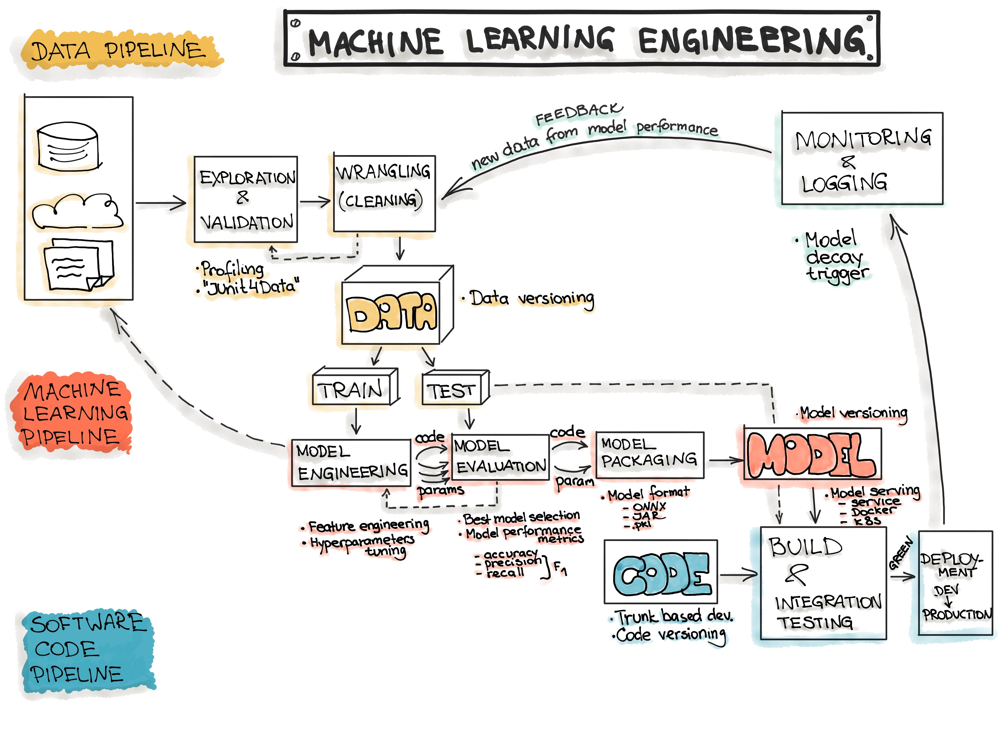
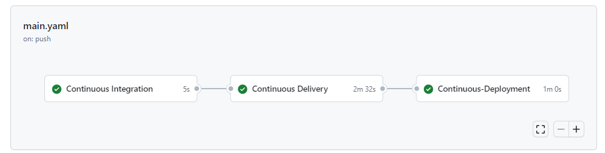

# Delivery Time Prediction Project

This project aims to predict the delivery time for a given order based on historical delivery information. The dataset used for this project contains various attributes such as delivery person's age, ratings, location coordinates, order details, weather conditions, and more.

## Dataset

The dataset used for this project contains the following attributes:

- `Delivery_person_Age`: Age of the delivery person
- `Delivery_person_Ratings`: Ratings of the delivery person
- `Restaurant_latitude`: Latitude of the restaurant
- `Restaurant_longitude`: Longitude of the restaurant
- `Delivery_location_latitude`: Latitude of the delivery location
- `Delivery_location_longitude`: Longitude of the delivery location
- `Order_Date`: Date of the order
- `Time_Orderd`: Time when the order was placed
- `Time_Order_picked`: Time when the order was picked up by the delivery person
- `Weather_conditions`: Weather conditions at the time of delivery
- `Road_traffic_density`: Traffic density on the road at the time of delivery
- `Vehicle_condition`: Condition of the delivery vehicle
- `Type_of_order`: Type of the order (e.g., Snack,Meal etc.)
- `Type_of_vehicle`: Type of delivery vehicle used
- `multiple_deliveries`: Indicator of whether the delivery person is making multiple deliveries at once
- `Festival`: Indicator of whether it is a festival day
- `City`: Type of the city(Urban,Rural etc)
- `Time_taken (min)`: Time taken for delivery in minutes (target variable)

## Project Pipeline

This project follows a pipeline approach with the following steps:

1. **Data Ingestion**: In this step, data is fetched from the source. This may include reading data from a CSV file, a database, or an API.

2. **Data Transformation**: The fetched data is then transformed to prepare it for machine learning. This step involves cleaning the data by imputing missing values, transforming features, scaling the features, and handling categorical features To understand the EDA (Exploratory Data Analysis) process, please refer to the [eda.ipynb](notebooks/eda.ipynb) file located in the `notebooks` directory. This Jupyter notebook provides a detailed overview of the data analysis and visualization techniques used in our project.

3. **Training Pipeline**: Once the data is cleaned and transformed, it is used to train different machine learning models. The models used in this project include Linear Regression (Ridge, Lasso, ElasticNet), Decision Tree Regressor, Random Forest Regressor, GradientBoost, AdaBoost, and XGBoost. Among these, XGBoost performed well with the highest test R2 score.

4. **Predict Pipeline**: After training the models, a predict pipeline is created to take input from the user in the form of order details. The trained model is then used to predict the delivery time based on the input, and the result is rendered on a result page.

5. **Flask Application**: The predict pipeline is integrated with a Flask application, which provides a user-friendly interface for users to input order details and receive predicted delivery time as output.



## CI/CD Pipeline

Our project uses a CI/CD pipeline to automate the build and deployment process. The pipeline is implemented using GitHub Actions and Amazon EC2, with Docker and Amazon ECR for containerization and image registry.

The steps in our CI/CD pipeline are as follows:

1. A GitHub workflow is configured to trigger on specific events, such as pushes or pull requests to the main branch.
2. The workflow runs on an Amazon EC2 instance and builds a Docker image based on the project's Dockerfile.
3. The Docker image is then pushed to Amazon ECR, our container image registry.
4. Finally, the container is deployed and run on our production environment.

To set up a similar CI/CD pipeline for your own ML project, you can refer to the following resources:

- [GitHub Actions documentation](https://docs.github.com/en/actions)
- [Amazon EC2 documentation](https://aws.amazon.com/ec2/)
- [Docker documentation](https://docs.docker.com/)
- [Amazon ECR documentation](https://aws.amazon.com/ecr/)

For detailed configuration examples and code snippets, please refer to our [workflow file](.github/workflows/main.yml) in the `.github/workflows` directory.




## Usage

To use this project, follow the steps below:

1. Clone the repository to your local machine.

### Create a conda environment
```
conda create -p venv python==3.8

conda activate venv/
```
### Install the necessary libraries
```
pip install -r requirements.txt
```

3. Run the Flask application by executing `python app.py` in the terminal.

4. Access the Flask application in your web browser and enter the order details in the form.

5. Click the "Predict" button to get the predicted delivery time.

6. The predicted delivery time will be displayed on the result page.

## Insights

Based on the analysis of the dataset and the trained machine learning models, some meaningful insights were obtained:

- The age and ratings of the delivery person, weather conditions, road traffic density, and multiple deliveries were found to have a significant impact on the delivery time.
